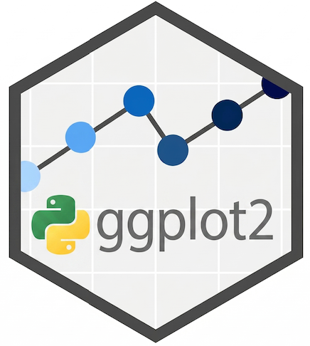

# ggplot2_py <a href="https://github.com/R2pyBioinformatics/ggplot2_py"></a>

[](https://pypi.org/project/ggplot2-python/)

AI-assisted Python port of the R **ggplot2** package — Create Elegant Data Visualisations Using the Grammar of Graphics.

## Overview

ggplot2_py implements the grammar of graphics in Python, faithfully porting R's ggplot2 using pandas DataFrames as the data container and a Cairo-based rendering backend. It supports 47 geoms, 32 stats, faceting, coordinate systems, themes, guides, and 130+ scales.

Beyond a direct port, ggplot2_py adds **Python-exclusive features** that extend the Grammar of Graphics with Python-native idioms while preserving full orthogonality of GOG components.

## Python-Exclusive Features

These capabilities have no R equivalent and leverage Python-specific language features:

| Feature | Python mechanism | What it enables |
|---------|-----------------|-----------------|
| **Callable `aes()` expressions** | First-class functions / lambdas | `aes(y=lambda d: np.log(d["mpg"]))` — inline data transforms without pre-computing columns |
| **`after_stat()` / `after_scale()` callables** | Same | `after_stat(lambda d: d["count"] / d["count"].sum())` — arbitrary expressions at each pipeline stage |
| **`singledispatch` extensibility** | `functools.singledispatch` | `@update_ggplot.register(MyClass)` — any Python class can be added to a plot with `+` |
| **Build hooks** | Dict-keyed callback lists | `plot.add_build_hook("after", BuildStage.COMPUTE_STAT, fn)` — intercept data at any of 16 named pipeline stages |
| **Auto-registration** | `__init_subclass__` | `class GeomStar(Geom): ...` auto-registers; no manual wiring needed |
| **Protocol contracts** | `typing.Protocol` | `isinstance(my_geom, GeomProtocol)` — structural type checking for extensions |
| **Scoped defaults** | `contextvars.ContextVar` | `with ggplot_defaults(theme=theme_minimal()): ...` — thread-safe scoped defaults |
| **Functional composition** | `sum` / `reduce` over `__add__` | `sum(parts, start=ggplot(data))` — compose plots without the `+` operator, useful for programmatic plot construction |

## Installation

```bash
# From PyPI
pip install ggplot2-python
```

For a local development:

```bash
git clone https://github.com/Bio-Babel/ggplot2-python.git
cd ggplot2_py
pip install -e ".[dev]"
```

## Quick Start

```python
from ggplot2_py import *
from ggplot2_py.datasets import mpg

(ggplot(mpg, aes(x="displ", y="hwy", colour="class"))
 + geom_point()
 + geom_smooth(method="lm")
 + facet_wrap("drv")
 + theme_minimal()
 + labs(title="Engine Displacement vs Highway MPG"))
```

### Callable expressions in aes (Python-exclusive)

```python
import numpy as np
from ggplot2_py import ggplot, aes, geom_point, geom_histogram, after_stat

# Inline data transform — no need to pre-compute a column
ggplot(mpg, aes(x=lambda d: np.log(d["displ"]), y="hwy")) + geom_point()

# Normalised histogram — callable in after_stat
(ggplot(mpg, aes(x="hwy"))
 + geom_histogram(aes(y=after_stat(lambda d: d["count"] / d["count"].sum())), bins=15))
```

### Extending with custom types (Python-exclusive)

```python
from ggplot2_py import update_ggplot

class Watermark:
    def __init__(self, text): self.text = text

@update_ggplot.register(Watermark)
def _add_watermark(obj, plot, object_name=""):
    plot.labels["caption"] = f"[{obj.text}]"
    return plot

# Now use with +
ggplot(mpg, aes("displ", "hwy")) + geom_point() + Watermark("DRAFT")
```

### Scoped defaults (Python-exclusive)

```python
from ggplot2_py import ggplot_defaults

with ggplot_defaults(theme=theme_minimal()):
    p1 = ggplot(df, aes("x", "y")) + geom_point()   # theme_minimal applied
    p2 = ggplot(df, aes("x", "y")) + geom_bar()     # theme_minimal applied
# Outside: no defaults
```

### Functional composition with `sum()` / `reduce()` (Python-exclusive)

The `+` operator is the canonical ggplot2 syntax.  Because `GGPlot.__add__` is defined and every component family is registered with
the `update_ggplot` singledispatch generic, **Python's iterable-composition
idioms also work directly** — useful for programmatic plot building, list
comprehensions, or just function-style code:

```python
# 1) `sum(parts, start=ggplot(data))` — the canonical function-style form
def fnplot(data, *parts):
    return sum(parts, start=ggplot(data))

fnplot(
    mpg,
    aes(x="displ", y="hwy", colour="class"),
    geom_point(),
    geom_smooth(method="lm"),
    facet_wrap("drv"),
    theme_minimal(),
)

# 2) `sum` over an iterable, no helper needed:
sum(
    [aes(x="displ", y="hwy"), geom_point(), theme_minimal()],
    start=ggplot(mpg),
)

# 3) `functools.reduce` — the canonical Python composition operator:
from functools import reduce
from operator import add
reduce(add, [aes(x="displ", y="hwy"), geom_point(), theme_minimal()], ggplot(mpg))

# 4) List on the RHS of `+` — recursive add via the list-dispatch:
ggplot(mpg, aes("displ", "hwy")) + [geom_point(), geom_smooth(), theme_minimal()]
```

> One caveat: Python's built-in `sum` has the signature
> `sum(iterable, /, start=0)` — it accepts *one* iterable plus an optional
> `start`, **not** variadic arguments.  `sum(a, b, c, d)` raises `TypeError`;

## Tutorials

### User Tutorials
- [Getting Started](tutorials/ggplot2.ipynb) — core concepts: data, aes, geoms, stats, scales, facets, coords, themes
- [Geom Gallery](tutorials/geoms_gallery.ipynb) — boxplot, violin, density, tile, hex and combinations
- [Labels & Facets](tutorials/labels_and_facets.ipynb) — axis titles, plot title/subtitle/caption, facet strip labels
- [Aesthetic Specs](tutorials/aesthetic_specs.ipynb) — colour, fill, alpha, linetype, shape, size, colour scales
- [Extending ggplot2](tutorials/extending_ggplot2.ipynb) — custom stats, geoms, themes via ggproto

### Python-Exclusive Feature Tutorials
- [Callable aes Expressions](tutorials/aes_expressions.ipynb) — lambdas in `aes()`, `after_stat()`, `after_scale()`, `stage()`
- [Extensible Pipeline](tutorials/pipeline_dispatch.ipynb) — `singledispatch` registration, custom types with `+`
- [Build Hooks](tutorials/build_hooks.ipynb) — intercepting the 16-stage build pipeline

### Developer Guide
- [Developer Guide: Extending ggplot2_py](tutorials/developer_guide.ipynb) — comprehensive guide covering ggproto system, custom Stat/Geom creation, Protocol contracts, singledispatch, hooks, auto-registration, context manager, and packaging

## Extension Architecture

ggplot2_py is designed as an **extensible platform**. The following table summarises all extension points:

| Extension point | Mechanism | How to use |
|----------------|-----------|-----------|
| Custom Stat | Subclass `Stat` | Override `compute_group()` — auto-registered via `__init_subclass__` |
| Custom Geom | Subclass `Geom` | Override `draw_panel()` — auto-registered |
| Custom Scale | Subclass `ScaleContinuous` / `ScaleDiscrete` | Implement `train()`, `map()`, `get_breaks()` |
| Custom Coord | Subclass `Coord` | Override `transform()`, `setup_panel_params()` |
| Custom Facet | Subclass `Facet` | Override `compute_layout()`, `map_data()` |
| Custom Position | Subclass `Position` | Override `compute_layer()` — auto-registered |
| Custom `+` types | `@update_ggplot.register(MyClass)` | Register any Python class for the `+` operator |
| Custom plot types | `@ggplot_build.register(MyPlot)` | Override the entire build pipeline |
| Build hooks | `plot.add_build_hook(timing, stage, fn)` | Intercept data at any pipeline stage |
| Protocol validation | `isinstance(obj, GeomProtocol)` | Verify structural conformance |
| Scoped defaults | `with ggplot_defaults(theme=...):` | Thread-safe scoped defaults |
